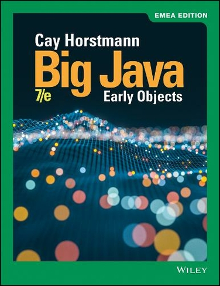

# BigJava
A repository for programs I write related to "Big Java: Early Objects" by Cay Horstmann.
(7th edition, 2019)
# Projects
After each chapter I completed review and practice exercises. 
Then, I made projects.
Following are links to projects I made after each chapter.
## [chapter 4](chapter04/programming-projects)
 - P4.1-CarCostCalculator
## [chapter 5](chapter05/programming-projects)
 - P5.5-UnitConversion
 - P5.9-LeapYearComputer
 - P5.10-DecimalToRomanNumberConverter
## [chapter 6](chapter06/programming-projects)
 - P6.1-CreditCardNumberChecker
 - P6.2-NthFibonacciNumberPrinter
 - P6.3-PrimeFactorisation
 - P6.5-GameOfNim
 - P6.9-DiceBets
 - P6.11-CombinationLockMinimumUnlockTwists
## [chapter 7](chapter07/programming-projects)
- P7.4-RestroomStallsFillingSimulator
- P7.8-TheatreSeatPicker
- P7.9-TicTacToe
- P7.10-VideoPokerSimulator
- P7.11-TheGameOfLife
- P7.12-PetShopInvoiceDiscount
## [chapter 8](chapter08/programming-projects)
- P8.1-ComboLockClass
- P8.2-SpaceSavingPictureGallery
- P8.6-CommaSeparatedValues(CSV)TableReader
- P8.7-USPostalServiceZipCodeBarCodeConverter
- P8.11-CannonballFiringSimulator
## [chapter 9](chapter09/programming-projects)
- P9.1-ChessPieceValidMovesLister
- P9.2-TimeZonesClock
- P9.8-ResistorsCircuitResistanceComputer
## [chapter 10](chapter10/programming-projects)
- P10.6-7-8-9-10-11-FilterInterface
- P10.16-BoardGameInterfaceTicTacToeAndNim
- P10.19-GUITicTacToe
## [chapter 11](chapter11/programming-projects)
- P11.2-BoyAndGirlBabyNamesPrinter
- P11.3-WebPageToFileWriter
- P11.4-CSVFileReader
