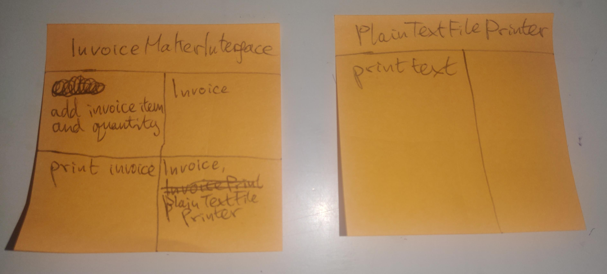
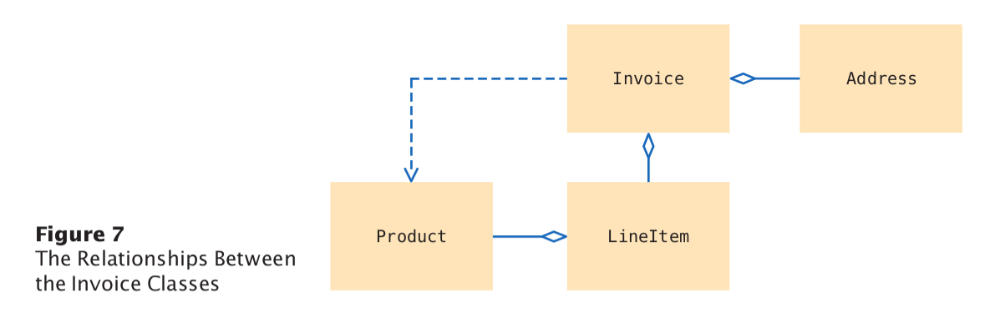

# problem description

## •• E12.1 

Provide a user interface to the invoice program in Section 12.3 that allows a user to enter and print an arbitrary invoice. Do not modify any of the existing classes.

# problem-solving

program in section 12.3 requirements specification:

The task of our sample program is to print out an invoice. An invoice describes the charges for a set of products in certain quantities. (We omit complexities such as dates, taxes, and invoice and customer numbers.) The program simply prints the billing address, all line items, and the amount due. Each line item contains the description and unit price of a product, the quantity ordered, and the total price.

classes from invoice program in section 12.3:

- com.bigjava.invoice.Address
- com.bigjava.invoice.Invoice
- com.bigjava.invoice.LineItem
- com.bigjava.invoice.Product

program test class:

- com.bigjava.invoice.InvoicePrinter

task for exercise 12.1:

- Provide a user interface that allows a user to enter and print an arbitrary invoice.

## 1 requirements specification

The task of the program I am designing is to provide a user interface for create and print an arbitrary invoice.  
Users should be able to use the interface to add items and their quantities to an invoice, 
and then print the invoice they have created to a file.

For example, when I start the program I will have an empty invoice with no items added, 
and then a user will add items to the invoice by entering products and quantities to add to
the invoice, such as 2 loafs of bread and 1 jar of jam.
The interface lets the user print an invoice by pressing a print invoice button and letting
the user choose the name of the output file.

## 2 brainstorming candidate classes

- com.bigjava.invoice.InvoiceMakerInterface
- ItemAdder
- com.bigjava.invoice.InvoicePrinter
- PrintButton
- Button
- QuantitySpecifier
- LineItemAdder

## 3 listing the major tasks my program must complete

1. allow users to enter invoice items and their quantities via a user interface
2. allow users to print the invoice they have created via a user interface

## 4 discovering methods and classes with the CRC cards method

start discovering classes and methods one major task at a time:

1. task #1: allow users to enter invoice items and their quantities via a user interface
2. task #2: allow users to print the invoice they have created via a user interface

## 5 document methods and classes I discovered using JavaDoc

[Javadoc HTML page with links to documentation for all classes](./method-documentation/allclasses-index.html "Javadoc HTML page with links to documentation for all classes").

## 6 implement methods and classes I discovered and documented

See Java source files in directory [chapter12.invoice.exercise1 package](./src/chapter12/invoice/exercise1).
