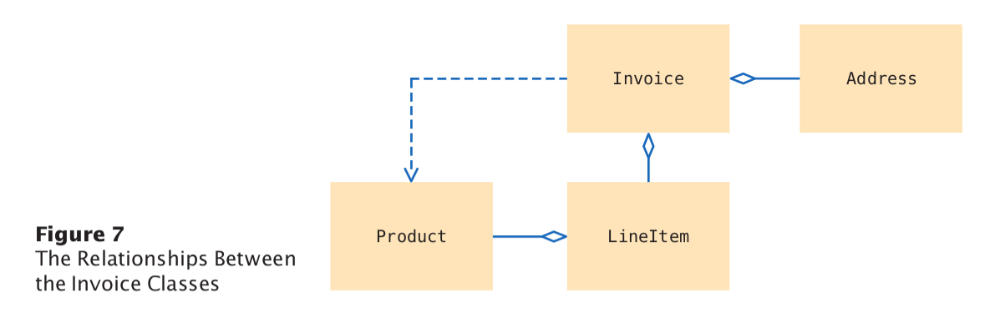
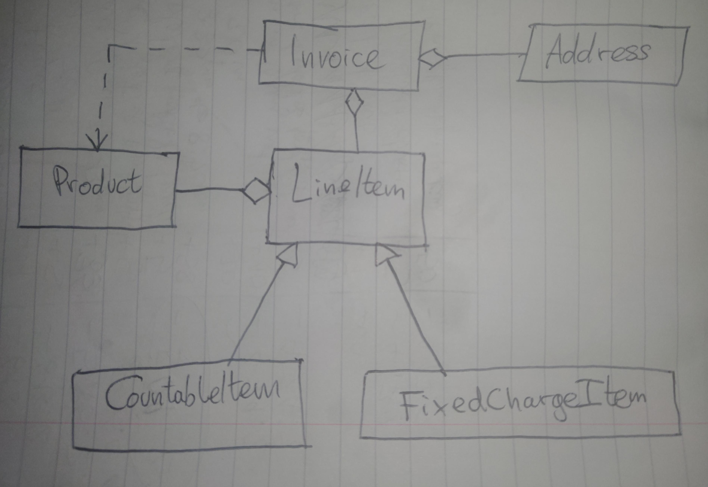
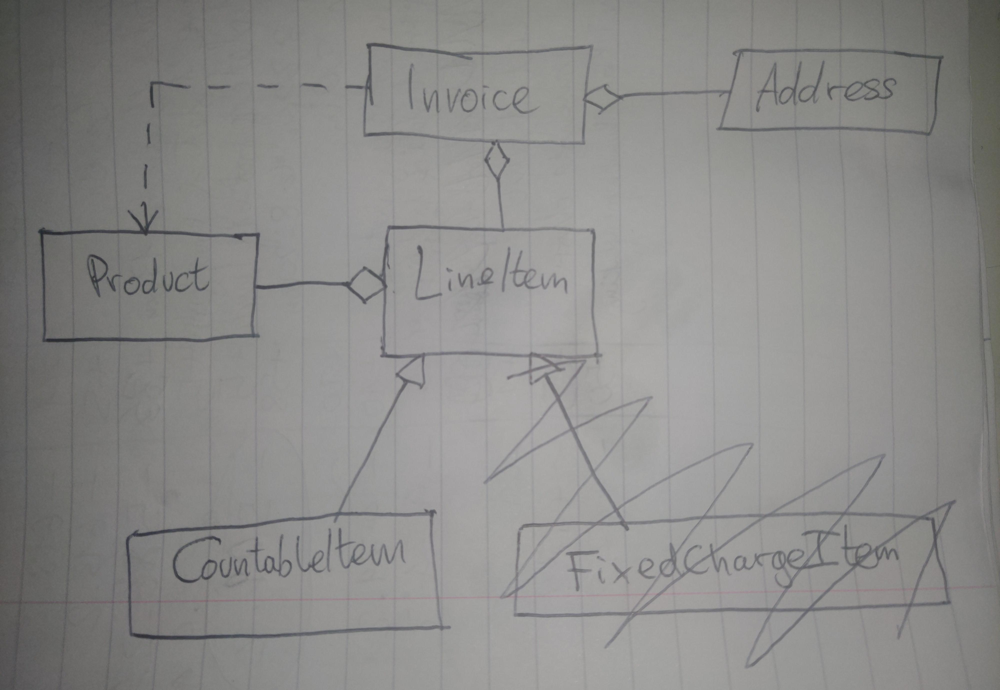

# • E12.2 

Enhance the invoice-printing program by providing for two kinds of line items: One
kind describes products that are purchased in certain numerical quantities (such as
“3 toasters”), another describes a fixed charge (such as “shipping: $5.00”). Hint: Use
inheritance. Produce a UML diagram of your modified implementation.

# problem solving

  

1st iteration of new class design:  

2nd iteration of new class design:  
after having realised that a countable item was a special kind of fixed charge
item, so I didn't need to make a fixed charge item class which inherited from
line item too. I haven't used inheritance for a while now. Since learning it I 
think. I was treating the LineItem class like an interface type that needed to 
be implemented to be useful in my first iteration of the UML OOP class design.
But it's not an interface type, it's a superclass. 

