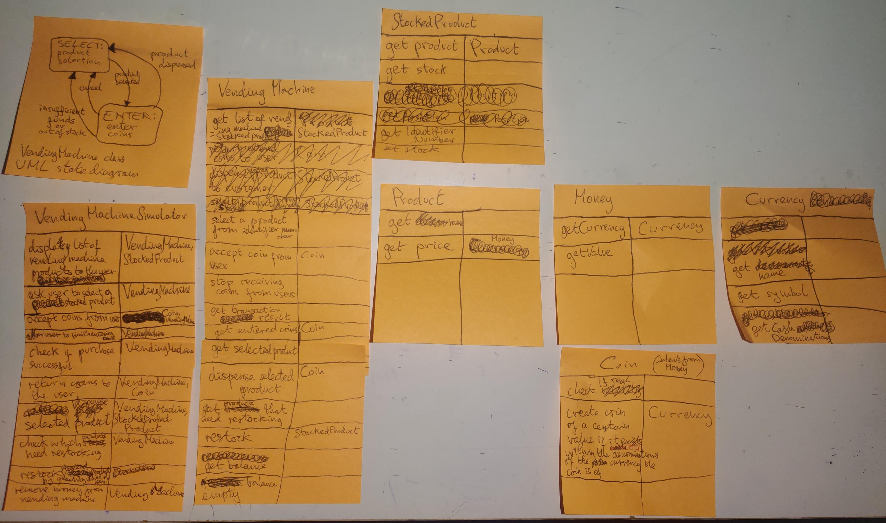
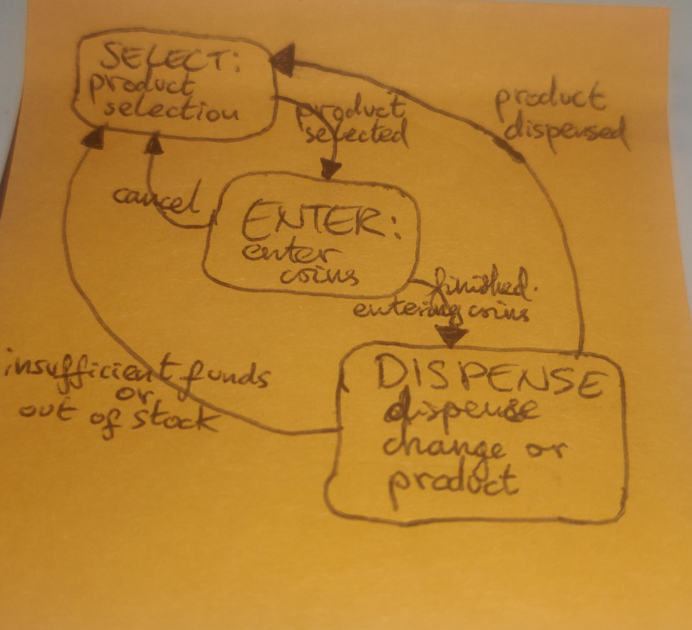
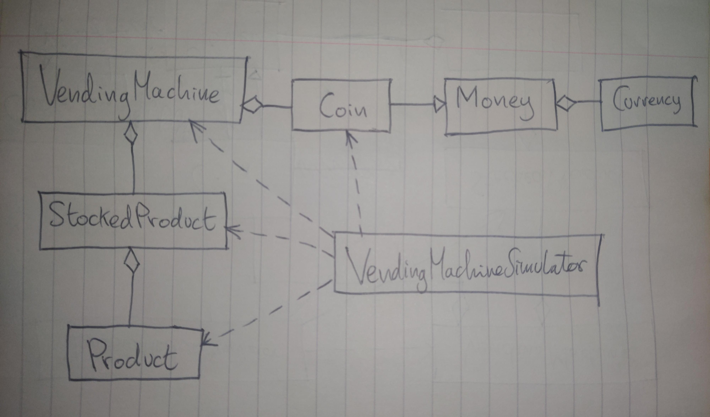

# •• P12.1 project description
 
Write a program that simulates a vending machine. Products can be purchased by
inserting coins with a value at least equal to the cost of the product. A user selects a
product from a list of available products, adds coins, and either gets the product or
gets the coins returned. The coins are returned if insufficient money was supplied
or if the product is sold out. The machine does not give change if too much money
was added. Products can be restocked and money removed by an operator. Follow
the design process that was described in this chapter. Your solution should include a
class chapter12.projects.VendingMachine that is not coupled with the Scanner or PrintStream classes.

# object-oriented program design

## step 1: write program requirements in plain English

The task of this program is to simulate a vending machine.  
A vending machine is a self-regulating shop.  
There are products which can be purchased by customers.  
A user selects a product from a list of available products.  
Then a user adds coins to the vending machine.  
If the coins are insufficient or the product is out of stock, they are returned.  
Otherwise, the product is dispensed.  
The vending machine does not give change if too much money was added.  
Products can be restocked and money removed by an operator.  

For example, a typical user interaction might be to:  
1. walk up to vending machine
2. see list of products displayed by vending machine
3. select a product by pressing the associated button or entering the associated number
4. entering coins into the vending machine
5. informing the vending machine that they are done entering coins
6. if the coins are insufficient or the product selected is out of stock, the coins are returned
7. otherwise the product is dispensed and no change is returned to the user

An operator interaction might be to:
1. check which items need restocking
2. restock items
3. remove money from the vending machine

## step 2: brainstorm candidate classes (requirements specification nouns & problem domain concepts)

- VendingMachineSimulator
- chapter12.projects.VendingMachine
- chapter12.projects.Product
- Window
- Customer
- User
- chapter12.projects.Coin
- Change
- chapter12.projects.Money
- Operator

## step 3: list major program tasks

1. display list of vending machine products to user
2. allow user to select a product
3. accept coins from the user after a product has been selected
4. allow user to inform vending machine that they are finished entering coins
5. if coins are insufficient or product is out of stock return coins to user
6. if coins are sufficient dispense product to customer
7. allow operator to check which items need restocking
8. allow operator to restock items
9. allow operator to remove money from the vending machine

## step 4: use CRC cards to discover object-oriented program methods and classes

  

## step 5: draw a UML class diagram to document class relationships in my OOP design

## step 6: document discovered methods and classes using Javadoc

- [javadoc documentation before implementation](method-documentation/before-implementation/allclasses-index.html)
- [javadoc documentation after implementation](method-documentation/after-implementation/allclasses-index.html)

## step 7: implement classes from object oriented design for vending machine program

See [Java source files](src/chapter12/projects/) and run VendingMachineSimulator.java.  
See [Test classes here](test-suite/chapter12/projects/).
