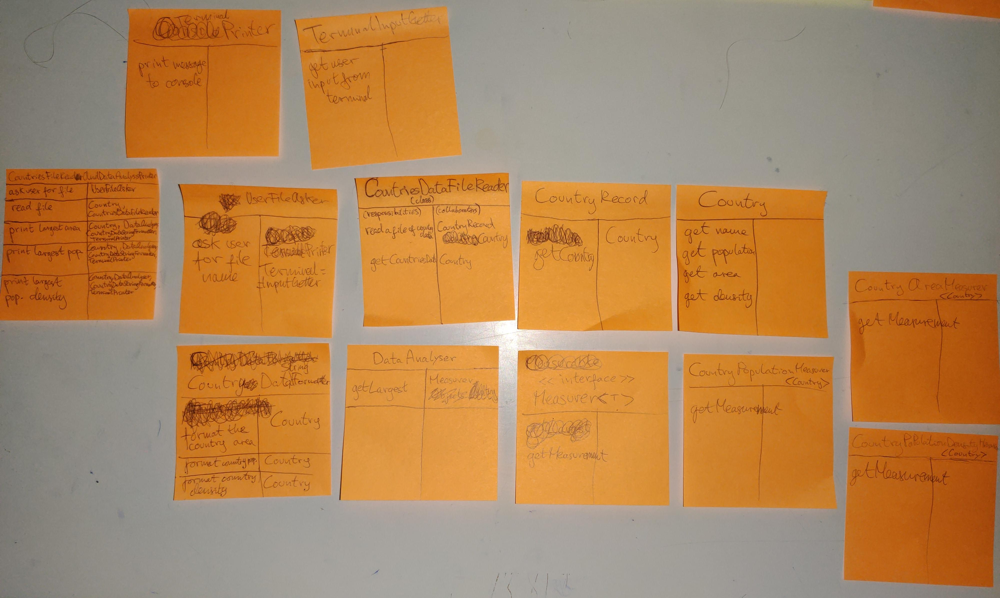
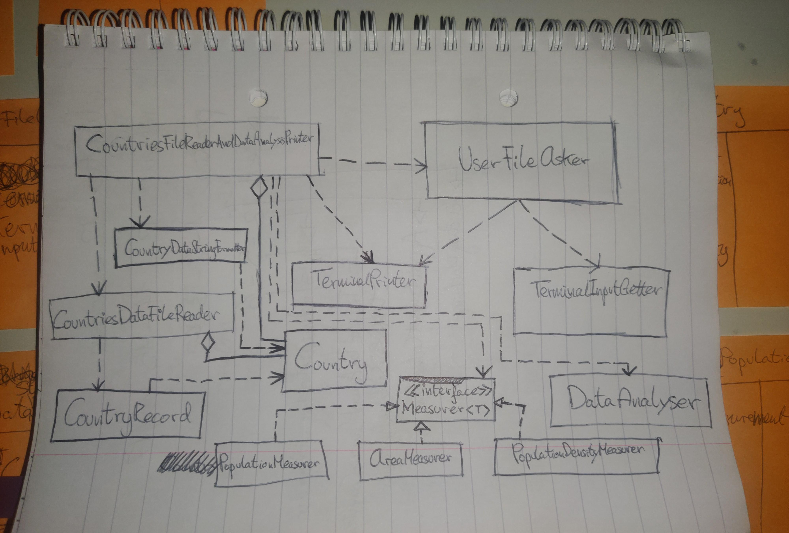

# Problem text

••• R12.13 
A file contains a set of records describing countries. Each record consists of the name
of the country, its population, and its area. 

Suppose your task is to write a program that reads in such a file and prints
- The country with the largest area.
- The country with the largest population.
- The country with the largest population density (people per square kilometer).

Think through the problems that you need to solve. 
What classes and methods will you need? 
**Produce a set of CRC cards, a UML diagram, and a set of javadoc comments.**

___

# Designing an object oriented program problem-solving

## step 1 gather requirements and write them in plain english

**What should the program _do_?**
already provided by the description of the country data analyser program. major tasks my program must do:
1. read in a file contains records describing countries consisting of the country name, population, and area
2. print the country with the largest area
3. print the country with the largest population
4. print the country with the largest population density

## step 2 discover candidate classes

- by looking at nouns in the requirements specification:
	- Record, 
	- Name, 
	- Population, 
	- Area, 
	- Country, 
	- Population Density, 

- and by thinking of names of entities in the problem domain:
	- File Reader, 
	- Printer,
	- Data Analyser,

## step 3 discover responsibilities

I already have a list of the major tasks my program needs to fulfil so I don't need to make this list again from looking at the verbs in the requirements specification.

**major tasks my program must do:**

1. read in a file contains records describing countries consisting of the country name, population, and area
2. print the country with the largest area
3. print the country with the largest population
4. print the country with the largest population density

Now I need to figure out which class is responsible for each behaviour.
And then ask myself what does an object of that class need to carry out that behaviour.
I will use the CRC card method for discovering classes and their responsibilities.

> - First task from my list of program tasks that is not trivial and intuitive for me to solve:
> 1- read in a file that contains records describing countries consisting of the country name, population, and area
> - next task: 2- print the country with the largest area
> - next: 3- print the country with the largest population
> - next: 4- print the country with the largest population density

##### See images for CRC card designs of this object oriented program:

##### iteration 1

##### iteration 2

## step 4 discover and describe relationships between classes by drawing a UML class diagram

See image in directory for UML class diagram of this object oriented program:

## step 5 document the discovered classes and methods
See java source files for discovered classes and methods with Javadoc method and class documentation:
- [Java source files](./class-documentation/)
- [Javadoc neatly formatted HTML documentation of class design](./class-documentation/allclasses-index.html)
