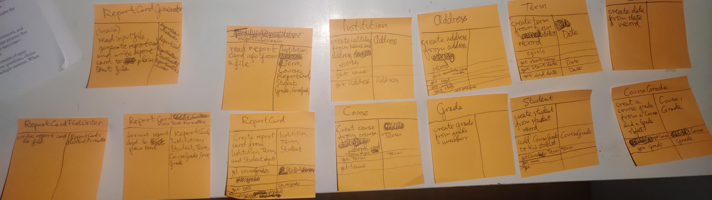
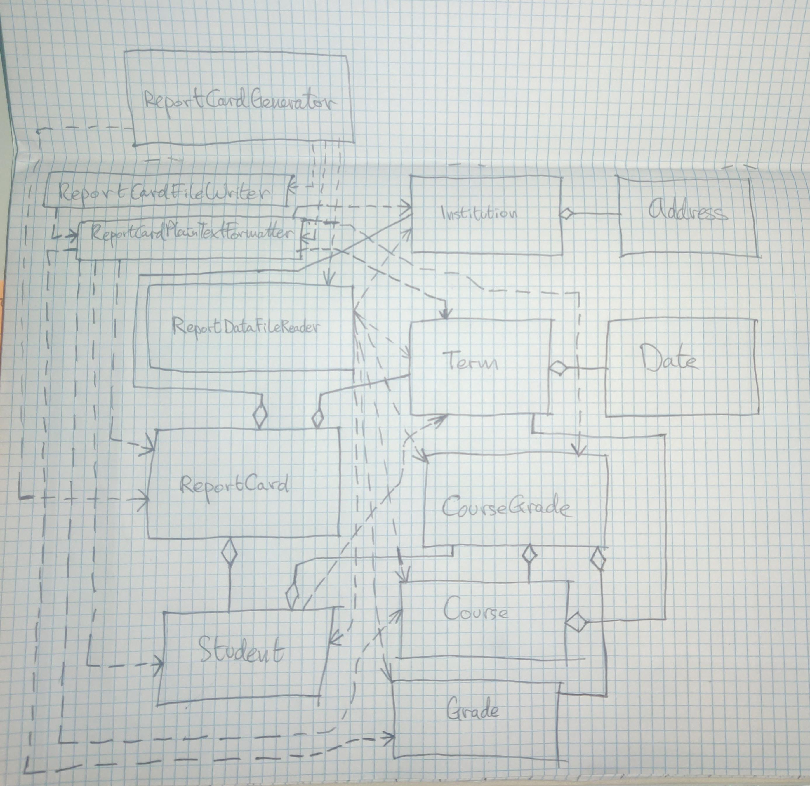

# problem description

## ••• R12.14 

Discover classes and methods for generating a student report card that lists all
classes, grades, and the grade point average for a semester. Produce a set of CRC
cards, a UML diagram, and a set of javadoc comments.

# Process of designing an object-oriented program which solves the problem

## step 1 Gather and write program requirements in plain English

The task of our program is to generate a student report card.
A student report card lists all classes, grades, and the GPA (Grade Point Average) for a semester.  
And the report belongs to 1 student.

A report card usually contains the following information:
- the institution that released the report card
- the student that the report referes to
- the term (semester) dates that the report refers to
- the subjects (classes) taken by the student during that term
- the grade obtained by the student in each subject (class)
- the average of the grades for all of the classes the student took that semester

The program generates a text file containing a student reports card. 
It should look something like:

> 
Report card

> 
> Institution: Sunny Side University
>
> Address: 
> 18, Sandy Beach Avenue, 
> Los Sol, CA 92383
> 
> Student: 
> Name: Gregory Jones 
> Student Number: 616-382
> 
> Semester: 
> Short Name: Winter 2024 
> Start Date: 10th September 2024 
> End Date 10th January 2025
> 
> | \# |  Courses | Grade  |
> | :---: | --- | ---: |
> | 1 | Java Programming | 4.0  |
> | 2 | Markdown Writing | 3.0  |
> | 3 | Meditation 101 | 1.0  |
> | Grade Point Average (GPA) | | 2.67 |

In the interest of simplicity the program does not feature a graphical user interface. Instead the program will read input from a file with report card information and write the generated report card to a new file. The name of the input file and the file to create will be given to the program from the user via the command line.

The program will get the grades with which to make the report card from a file provided as a command line argument to the program with the following format:

> institution  
> building number, road, city, state, postal code  
> student name, student number  
> semester start date (DD-MM-YY), semester end date (DD-MM-YY), semester short name  
> subject, grade  
> subject, grade

For example, an input file report-card.dat could look like the following:

> Sunny Side University  
> 18, Sandy Beach Avenue, Los Sol, CA, 92383  
> Gregory Jones, 616382  
> 10-09-24, 10-01-25, Winter 2024  
> Java Programming, 4.0  
> Markdown Writing, 3.0  
> Meditation 101, 1.0

## step 2 Discover candidate classes

Make a list of the nouns from the requirements specification:
- students
- report card
- classes
- grades
- GPA
- institution
- term
- date
- subjects
- courses
- average
- file

concepts from the problem domain:
- address (from the sample print out I made)
- table
- file reader 
- file writer

Cross out nouns that don't seem to be suitable class candidates,
and add names from the problem domain to create a list of **candidate** classes that I can choose from when selecting classes for my program design:
- Student
- ReportCard
- Course _(**Class** is a reserved word in Java so cannot be the name of a class)_
- Term
- Grade
- Institution
- Date
- Address
- FileReader
- FileWriter
- ReportCardFormatter

For testing the program:
- ReportCardGenerator (main method)

## step 3 Find out what methods you need to provide for each class to solve the programming problem

First, I need to list the major tasks I need my program to complete. A class in my design will be responsible for accomplishing each task with help from collaborator classes. To find the major tasks I need my program to complete a simple rule is to look for _verbs_ in the requirements specification.

verbs in the requirements specification:
- _generate_ a student report card
- _list_ all classes, grades, and the GPA
- _read_ input from a file
- _generate_ a report card to a new file

list of major tasks my program needs to complete:
1. read report card information from a file
2. list all classes, grades, and the GPA
3. write report card to a file

Use CRC cards to discover methods and classes for accomplishing each major task.

## step 4 Describe the relationships between classes in my design via a UML class diagram

## step 5 Document discovered classes and methods using javadoc comments and run javadoc to create documentation in neat HTML format

See [report card generator program class documentation](./class-documentation/allclasses-index.html "all classes javadoc generated HTML documentation")

_notes:_
1. As I was writing the javadoc comments I realised that the grade class could have been a super-class with a usaGradePointAverageGrade subclass. This way the program would have been more flexible in the future because it could have had an option for reading grades from different grading systems. For example:
    - the United States of America uses a Letter Grade Grade Point Average grading scale which goes from 0.0 to 4.0, with 1.0 usually considered the minimum passing grade for a course. The numeric values in the US letter grade GPA system correspond to letters: an A is a 4.0 grade, the highest score, a B is a 3.0 grade, a C is a 2.0 grade, a D is a 1.0 grade, the passing grade, and an F is a 0.0 grade. Sometimes the letter grades in the system use + and - symbols to represent a value of 0.3 in the US GPA grading scale. So a B+ corresponds to a GPA of 3.3 and an A- corresponds to a GPA of 3.7
    - 1.0 is the highest grade in Germany and 6.0 is  the lowest, with 4.0 usually being a passing grade
    - India and China use a percentage system with grade ranging from 0 to 100.
    - Universities in the United Kingdom use a class based classification for grades and degrees. A first, symbolised by a 1, is the highest grade, followed by a highest second, symbolised by a 2:1 and often called a "two-one", is the second highest grade classification, followed by a lower second, 2:2, which is followed by a third, 3, which is followed by a fail
    - 0 is the lowest grade in Italian universities and 30 is the highest, with 18 usually being a passing grade
    - France uses a 20 point grading scale with 0 being the lowest grade and 10 being the highest, with 10 usually being the minimum passing grade
2. Something else I realised while writing the javadoc comments is that the ReportCardFileWriter class need only be called PlainTextFileWriter because all it does is write plain text to a file, regardless of whether the text is a report card or not.
