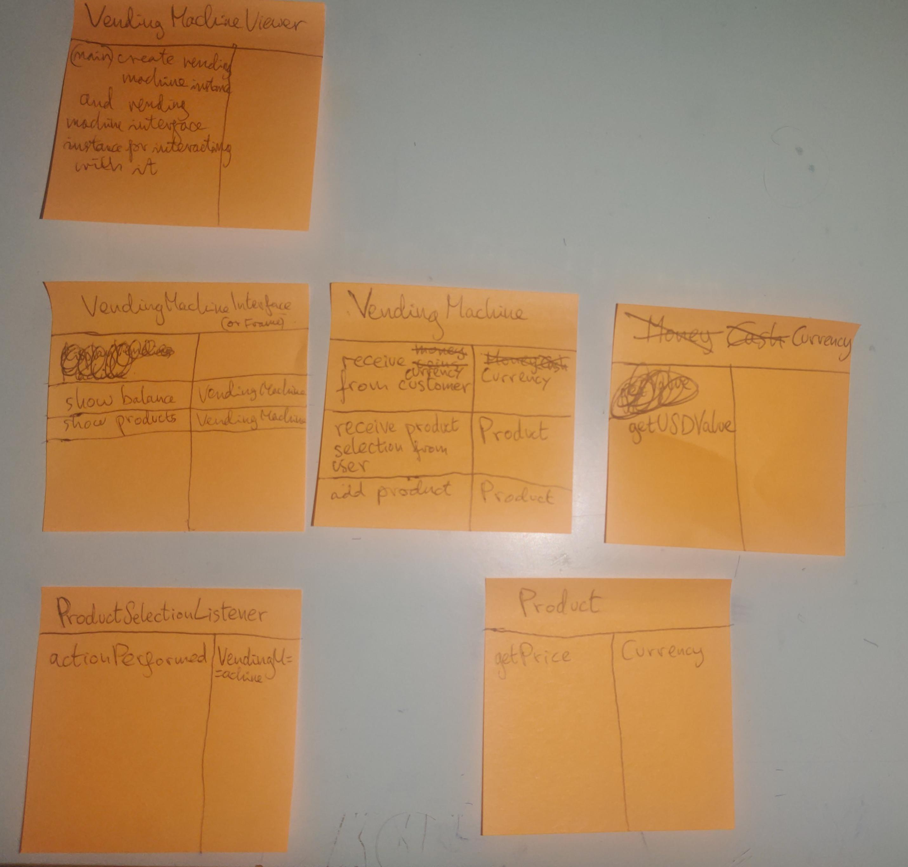

# problem description

•• R12.15 Consider the following problem description:  

_Users place coins in a vending machine and select a product by pushing
a button. If the inserted coins are sufficient to cover the purchase 
price of the product, the product is dispensed and change is given. 
Otherwise, the inserted coins are returned to the user._  

What classes should you use to implement a solution?

# problem-solving: object oriented program design for solving a computer programming problem

## step 1 gather requirements by writing them in plain English

_Requirements specification_: **What should the program do?**

The task is to make a program which simulates a vending machine.

The vending machine program should receive coins as input from a user, along with a product selection via a button press.  
If the inserted money is enough to buy the product, the product should be dispensed by the vending machine.  
Otherwise, the product should not be dispensed and the inserted money should be returned to the user.  

_note_ : I have a feeling a vending machine state machine diagram will come in handy when designing the vending machine class, because I will have to monitor its state. Either waiting for a user to insert any coins, waiting for a user to make a selection, or dispensing product and change. Although the latter could be a reponse to the previous state...  
Actually maybe not, waiting for the user to insert coins or make a selection is still the same state for the vending machine, i.e. it's still receiving money. And the dispensing product stage of the vending machine program doesn't change the state of the vending machine because it doesn't act any differently after dispensing a prdouct, instead it simply returns to the receiving money state. So the vending machine only was state which is to receive money from the customer.

An example scenario is that a vending machine has 3 products and:
1. a user enters the following coings in the following order: a quarter ($0.25), a dime ($0.1), a nickel ($0.05), and a dollar note ($1) for a total of $1.31 entered by the vending machine user  
2. a user presses the \#2 button for an item which costs $1.5
3. the vening machine does not dispense the item because the user did not enter enough money for the selected product
4. the user re-enters all of the coins entered previously and an addition quarter coin ($0.25) for a total of $1.56
5. the user re-selects item \#2 by pressing button \#2
6. the vending machine dispense 1 copy of item \#2 because the user balance is sufficient
7. the vending machine dispenses change of $0.06 cents to the customer in the form of a nickel coin ($0.05) and a 1 cent coin ($0.01)

## step 2 **brainstorm** candidate classes

_**candidate classes**_ from nouns in requirements specification and from concepts in problem domain:
- VendingMachine
- Customer
- ~~User~~
- ~~Input~~
- Product
- ~~Item~~
- ~~Money~~ ~~Cash~~ Currency
- ~~State~~
- ~~Coin~~
- ~~Selection~~
- ~~Change~~
- Button

Crossing out candidate classes that aren't useful because unecessary or duplicates of same concept represented by other candidate class.

## step 3 list the major tasks I need the program to complete

1. vending machine must receive coins from customer
2. vending machine must receive product selection from customer
3. vending must complete item and change dispense operation based on customer product selection and amount of money customer provided

_note_: I realise now, as I discover methods and classes using the CRC card method, that major task 3 is actually part of major task 2 because the vending machine must complete an item and change dispense operation following receiving a product selection form the user.

## step 4 discover methods and classes using CRC cards

Go through the major tasks I need my program to complete 1 at a time and ask myself which of my canididate classes should be reponsible for that class. Once I choose one make a CRC card for that class, write down the task in the responsibilities column and ask myself what collaborator objects the class will need to complete that task. And then write those objects in the collaborators column and create CRC cards for those other objects with their associated collaboration method in their responsibilities column. And then repeat the CRC card making process again by asking myself how they complete that task.

CRC cards for vending machine object oriented program design:

