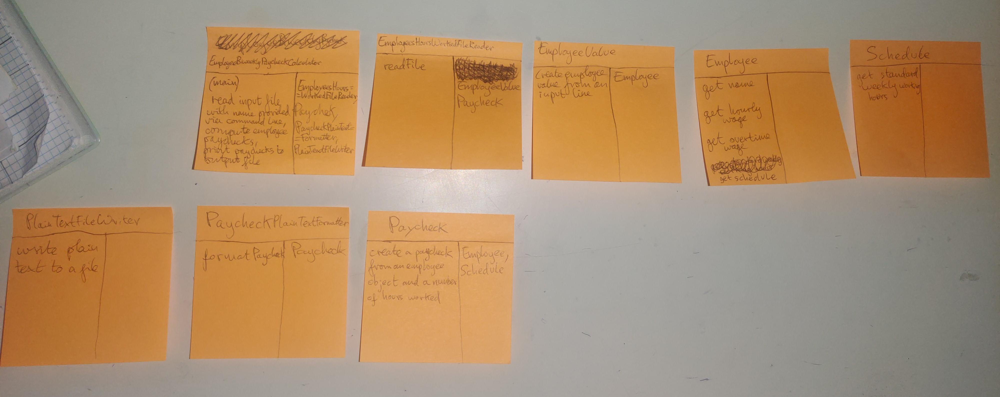

# review exercise problem description:

•• R12.16 Consider the following problem description:

_Employees receive their biweekly paychecks. They are paid their hourly rates for each hour worked; however, if they worked more than 40 hours per week, they are paid overtime at 150 percent of their regular wage._

What classes should you use to implement a solution?

# problem-solving: designing an Object-Oriented-Program for solving this programming problem

## step 1 gather requirements for the program by writing a requirements specification in plain English

The program task is to write an object-oriented computer program which computes employees biweekly paychecks based on the number of hours an employee has worked.

Biweekly means the employee paycheck is for the last 2 weeks of an employee's work.

Overtime hours are paid 150 percent their regular hourly wage, i.e. 1.5 times as much per hour.

All employees are scheduled to work 40 hours per week. So each addtional hour worked over the 40 standard hours is an overtime hour of work.

For simplicity the program will read in a data file containing data pertaining to employees and the hours they worked over 2 weeks.

And the program will output a file containing the amount each employee is due to be paid for the hours worked during the 2 weeks written in the input data file.

## step 2 brainstorm candidate classes

candidate classes, from nouns in requirements specification and concepts from the problem domain:
- Employee
- Paycheck
- ~~Wage~~
- Schedule
- Contract
- Employer
- EmployeesHoursWorkedFileReader
- FileReader
- BiweeklyHoursWorkedValue
- PaycheckWriter
- FileWriter
- PaycheckFormatter

## step 3 list major tasks the paycheck computer program needs to complete

1. read in file of employee names and working hours over 2 weeks
2. compute wage due to each employee for hours worked in input file
3. write employees and associated paychecks to output file

## step 4 discover methods and classes of objects using CRC cards

