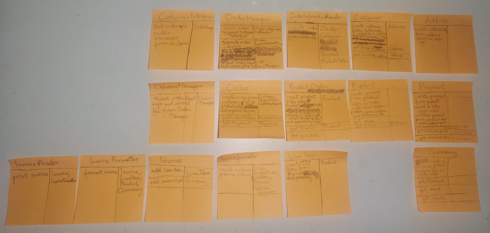
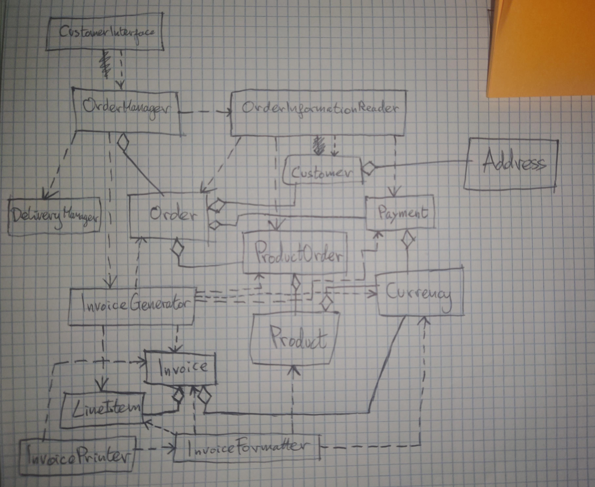

# exercise problem description:

•• R12.17 Consider the following problem description:

_Customers order products from a store. Invoices are generated to list the items and quantities ordered, payments received, and amounts still due. Products are shipped to the shipping address of the customer, and invoices are sent to the billing address._

Draw a UML diagram showing the aggregation relationships between the classes
Invoice, Address, Customer, and Product.

# object oriented program design for computer program problem

## step 1 gather requirements by writing them in plain English

The task of the program is to:
1. receive customer orders, 
2. generate invoices for those customer orders with:
    - a list of items and the quantities ordered, 
    - the payments received for the order, 
    - the amount still due by the customer to the store
3. deliver the order to the customer's shipping address
4. deliver the invoice to the customer's billing address

For the sake of simplicity I will assume there is some interface class, probably a web or app interface through which customers place orders which are then sent to the order management system.  
For the sake of simplicity I will also assume that there is a delivery management system for managing deliveries.

## step 2 brainstorm candidate classes for OOP design

candidate classes:
- Order
- Customer
- Store
- Invoice
- InvoiceGenerator
- InvoiceLineItem
- InvoiceFormatter
- InvoiceWriter
- OrderManager
- Product
- ~~Item~~
- Address
- Delivery
- Payment
- DeliveryManager
- ~~ShippingManager~~
- CustomerInterface
- OrderManager
- Package

## step 3 list the major tasks my program must complete

1. receive customer orders, 
2. generate invoices for those customer orders with:
    - a list of items and the quantities ordered, 
    - the payments received for the order, 
    - the amount still due by the customer to the store
3. deliver the order to the customer's shipping address
4. deliver the invoice to the customer's billing address

_note_:  
I realise as I design my OOP with the CRC card method that an order has a state which impacts how it behaves:
- in preparation
    - when an order is in preparation the delivery package and invoice are yet to be prepared
- ready to ship
    - when an order is ready to ship the delivery package and invoice are prepared and packed, and therefore ready to be shipped to the customer

## step 4 design class structure of my program by discovering objects and their behaviours using the CRC card system

## step 5 Record OOP design classes and their relationships using a UML class diagram

initial exercise task:  
Draw a UML diagram showing the aggregation relationships between the classes Invoice, Address, Customer, and Product.

Thoughts on my design and the relationships between the classes Invoice, Address, Customer, and Product:
- In my OOP design the aggregation, "has-a", relationships between Invoice and Product are absent because the Invoice class uses the LineItem class to product names and quantities for the invoice, and the LineItem objects are created by an InvoiceGenerator class which uses the ProductOrder class aggregated in an Order object to get the products and quantities to create LineItem objects with.  
Relationships between Invoice and Address or Customer class are absent too. Based on the requirements specification the invoice only needs to tally the ordered items and their individual and total price. And even if it needed their information the invoice generator would pass them to the invoice.
- The Address class is aggregated by the Customer class in my design, which means that the Customer class stores a reference to a one or more Address objects inside of it so that it can remember the Address object(s) between method calls.
- The Customer class in my design aggregates the Address class because the customer has both a shipping address and a billing address.
- The Product class in my design is aggregated by the ProductOrder class which represents an amount of a product which is ordered. And an Order object aggregates ProductOrder objects in a list because it can have many ProductOrders, and an Order object also aggregates ("has-a" reference to) a Customer object and a Payment object.
