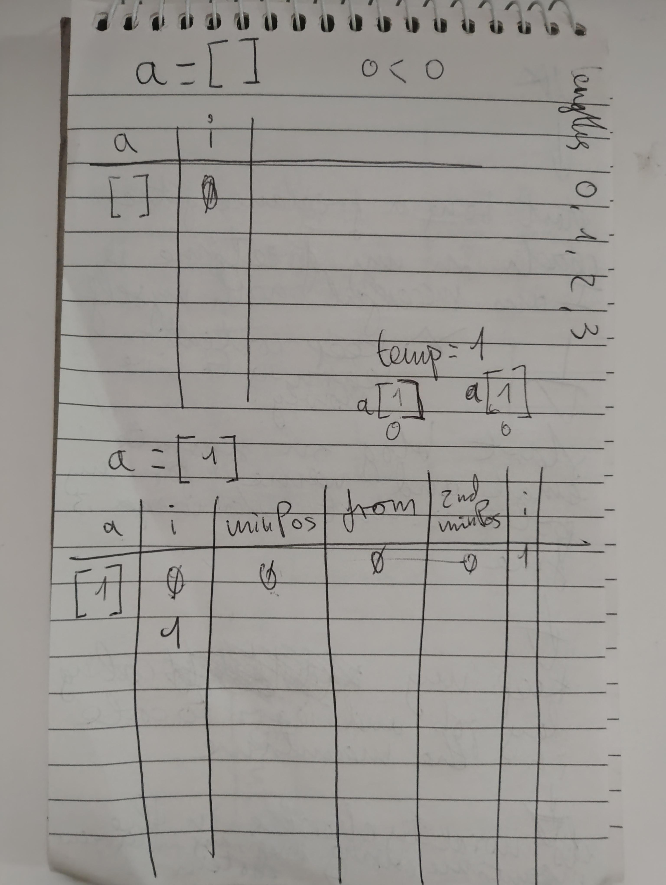
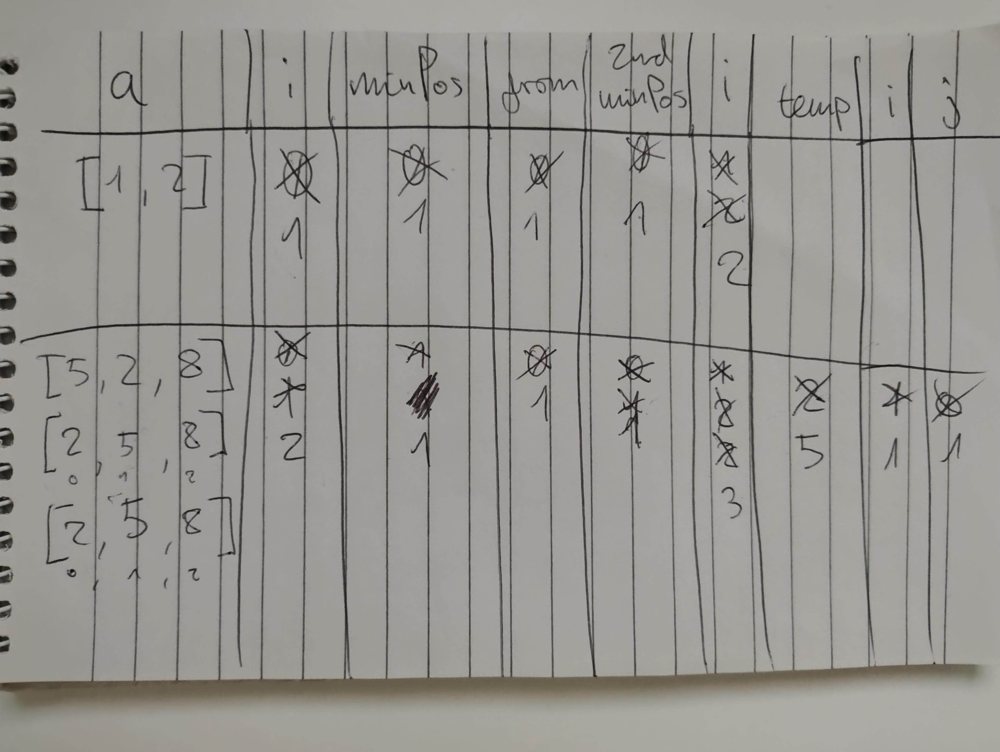

•• R14.4 Checking against off-by-one errors. When writing the selection sort algorithm of
Section 14.1, a programmer must make the usual choices of < versus <=, a.length
versus a.length - 1, and from versus from + 1. This is fertile ground for off-by-one
errors. Conduct code walkthroughs of the algorithm with arrays of length 0, 1, 2,
and 3 and check carefully that all index values are correct. 

Handtracing code of selection sort algorithms by writing variable names and values on a sheet of paper and mentally executing each step of the code:

