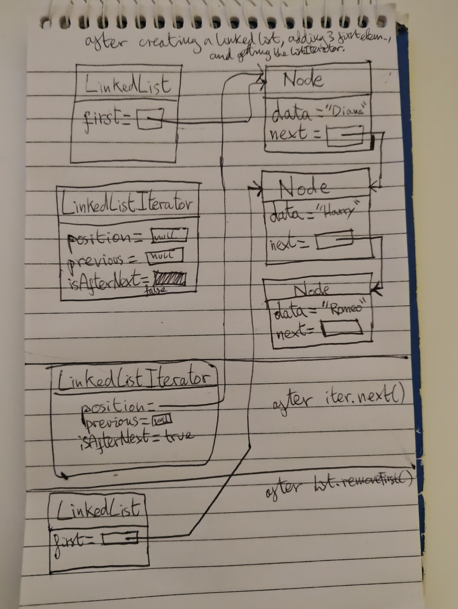

R16.10
It is not safe to remove the first element of a linked list with the removeFirst method
when an iterator has just traversed the first element. Explain the problem by tracing
the code and drawing a diagram.

The problem with calling removeFirst() on a doubly linked list when an iterator has just 
traversed the first element is that the iterator is unaware the reference to the first
node in the linked list has changed. 

It still holds a reference to what used to be the first node. 

Calling remove on the iterator will now throw a null pointer exception because the 
remove implementation uses the removeFirst and removeLast list methods to remove a 
node if the currentPositionNode matches the first or last instance variables from 
the linked list respectively. 
Because first will not match currentPosition seeing as it was removed
from the linked list via removeFirst(), the iterator remove implementation will
try to remove the node as if it was a node inbetween two other nodes.
It will try to access currentPosition node's previous node to reassign its next 
reference to the current node's next node, but this will throw a null pointer 
exception because the previous node of what was the first node will be null.

In a doubly linked list iterator a call to hasPrevious will return true even though 
there are no elements to the left of the cursor in the linked list. 
And a call to the previous method of the linked list iterator will return the data 
from what used to be the first node instead of throwing a no such element exception.

