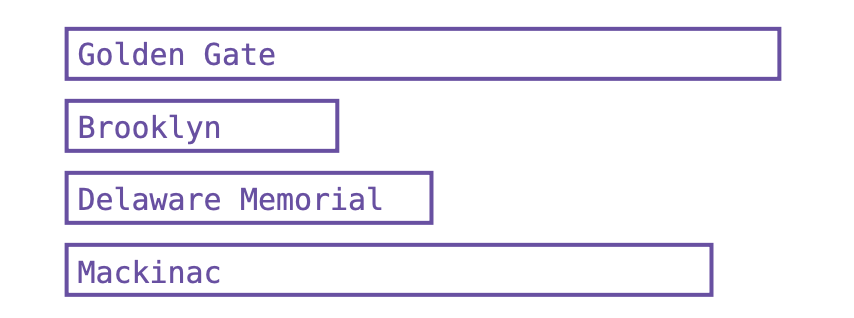
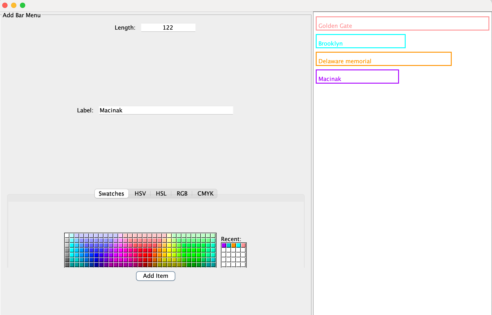

••• E20.9 Write a program that lets users design charts such as the following:

Use appropriate components to ask for the length, label, and color, then apply them
when the user clicks an “Add Item” button.

End result:

