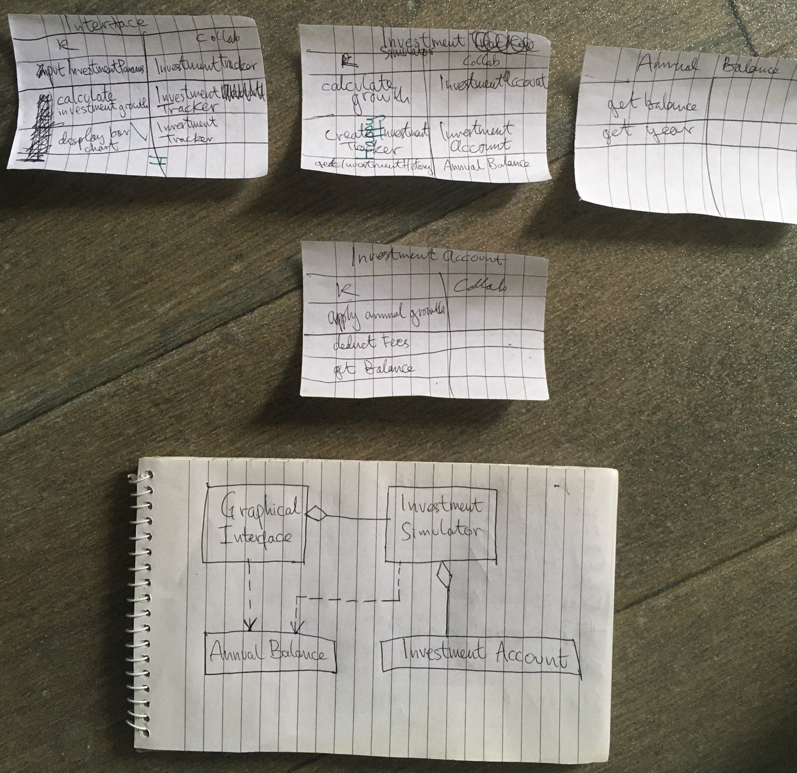

• P20.3 Write an application with three labeled text fields, one each for the initial amount of
a savings account, the annual interest rate, and the number of years. Add a button
“Calculate” and a read-only text area to display the balance of the savings account
after the end of each year.

•• P20.4 In the application from Exercise • P20.3, replace the text area with a bar chart that
shows the balance after the end of each year.

# program design

## gather requirements by writing them in plain english

The task of the program is to calculate the growth of a user's investment account.
The user inputs:

 - initial investment amount
 - annual contribution
 - annual growth rate
 - number of years
 - annual inflation rate

via a graphical user interface.

When the user presses the 'calculate' button the program draws a bar chart 
that shows the user's investment account balance after the end of each year,
 given the user provided inputs.

### a typical user scenario

A typical user scenario is to enter an initial investment amount, an annual contribution, 
an annual growth rate, a number of years, and an annual inflation rate via suitable graphical 
components, and then press the calculate button to see how there investment scenario would
turn out over the years. They would see the amount of money in their investment 
account after each year by looking at the bar chart which should display the amount of money in 
the investment account after each year, and the origin of the x-axis should start at zero.
So the labels on the x-axis will be the years, and each bar will also show a monetary amount.
If the user enters new inputs values and presses calculate again a new bar chart should be drawn.

## discover classes by writing down candidate classes from names in the requirements specification and in the problem domain

candidates:

- user
- investment
- account
- contribution
- growth rate
- years
- interface
- button
- bar chart
- balance
- inflation rate
- axis
- input values

## list major tasks my program needs to fulfill

1. Let user input initial investment amount, annual contribution, annual growth rate, number of years, 
and an annual inflation rate via a graphical user interface, 
and not fail when incorrect value types are inputted.
2. compute investment growth over the years via the growth of the balance in the account 
when 'calculate' button pressed.
3. display bar chart showing value of investment account over number of years labelled with balance and years.

## use CRC card methods to discover classes and responsibilities and their collaborators, and sketch out the resulting relationships between classes using a UML class diagram, and edit the CRC cards and diagram if I think something should change

## write the documentation of discovered classes and methods by writing java doc comments in java class source files

[Class and method documentation post-design and pre-implementation](./docdir/before-implementation/allclasses-index.html).
